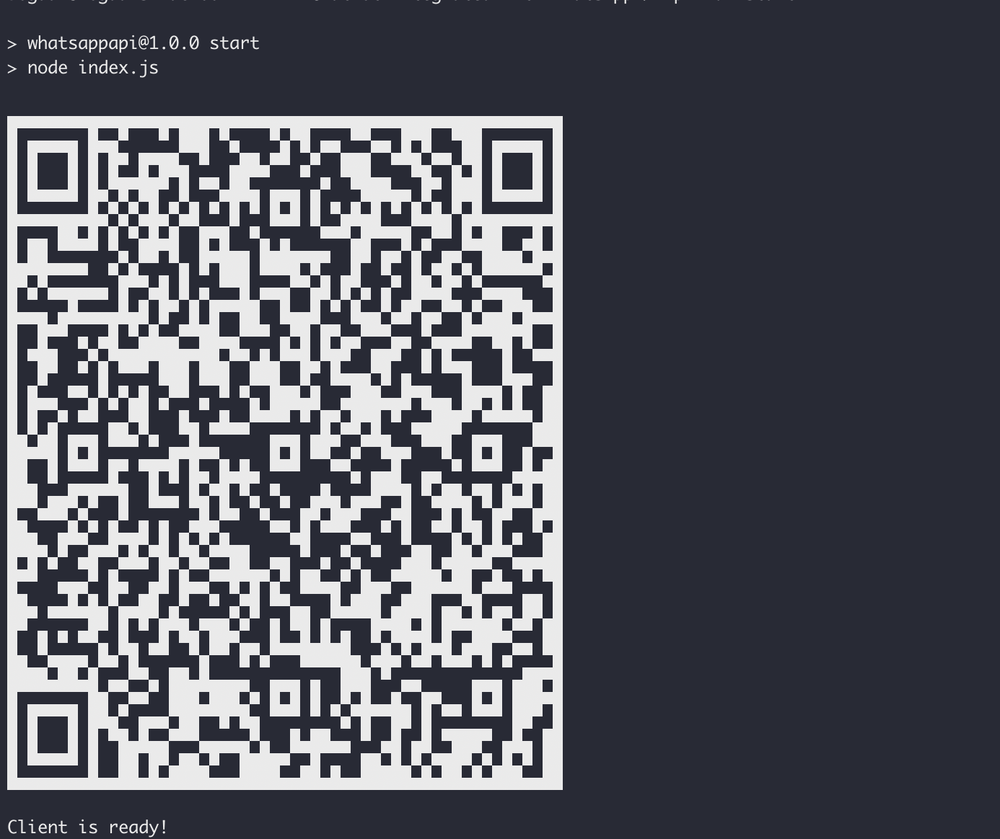

# Whatsapp chat bot that uses open Ai text-completion Api endpoint and whatsapp web js to reply to user queries.

## How to run this project

1. Create an `.env` file from the template:

    ```sh
    cp .env.example .env
    ```
2. Install the project dependencies:

   ```sh
   npm i
   ```
3. Run the project with thw following command:

   ```sh
   npm start
   ```

## How to use it

After launching the application, a qr code should be displayed in the console, you can scan it in the WatsApp mobile application. 

<p style="text-align:center">
  
</p>

This will connect our bot to the account from which the qr will be scanned the successful completion of this stage will confirm the output `Client is ready!` in the console.
Then you can use the bot. All letters to the user from whom authorization occurred will be processed by the bot
